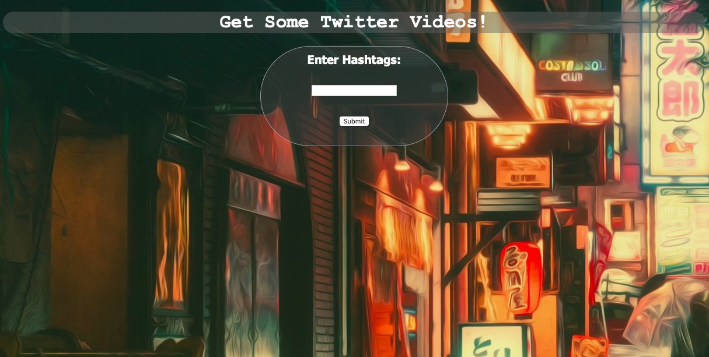
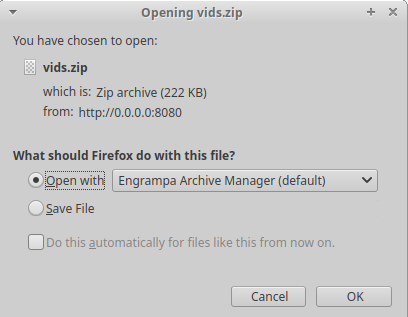

# twitter-summarizer-rest-service-E1visz
twitter-summarizer-rest-service-E1visz created by GitHub Classroom


## Project Mission
* Use Flask as your WEB service platform.   ------DONE.  
   Reference 1:  https://palletsprojects.com/p/flask/ (Github:  https://github.com/pallets/flask ).  
   Reference 2:  Flask-RESTFUL  (Github:  https://github.com/flask-restful/flask-restful ).  
* Integrate your module to become a RESTFUL system.   ------DONE.  
* Deploy your system to free AWS services:  https://aws.amazon.com/free/?all-free-tier.sort-by=item.additionalFields.SortRank&all-free-tier.sort-order=asc.  
* Develop simple WEB applications to test your system.   ------DONE.  
* Document your REST APIs on your Github.    ------DONE.  
* KEep your server off until we request it for grading.  We dont want you to waste money.   ------DONE.   


## Architecture Needed

* Python code running on computer.    

* twitter API(Tweepy).  

* Pillow(PIL).  

* OpenCV(cv2).  

* Queue, Threading.  

* Flask-rest. 

* Flask.   


## Run Program

*Assumes __OpenCV, Pillow, Flask__ package already installed.*

*Assumes __twitter API Keys__ available.*

*Requires __Python 3.x__ to run!*

1. Clone the repo by using the command below.
   ```
   $ git clone https://github.com/BUEC500C1/video-E1visz.git
   ```

2. Ensure the following Python packages are installed: cv2, PIL, tweepy
   ```
   $ pip install opencv-python  
   $ pip install pillow
   $ pip install tweepy
   $ pip install Flask
   ```
3. Add API key to local "configr.py" file and save:  
   ```
   consumer_key = "your API key"
   consumer_secret = "your API secret key"
   access_token = "your access token key"
   access_token_secret = "your access token secret key"
   ```
4. Open terminal/command window and navigate to folder where code was downloaded

5. Run the "resttest.py", and start the website at http://0.0.0.0:5000/.

6. Enter the hashtag and download the video.  


## Results


1. The website page.  
   
2. You can download the video.  
   


